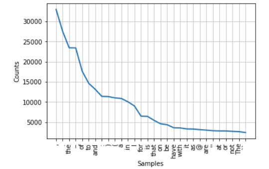

## Text Analysis with Python


In Python, there exists a few libraries specifically designed to work with text data.

- NLTK [https://www.nltk.org/](https://www.nltk.org/)

- SPACY [https://spacy.io/](https://spacy.io/)

- SCIKIT-LEARN [https://scikit-learn.org/stable/](https://scikit-learn.org/stable/)

Each of these libraries has its own history, and some of what they provide overlaps. Here's a helpful chart outlining some of their pros and cons.


Ultimately, which library you choose to use depends on what you want to do with your data, but there's some general principles for text analysis that you should consider regardless of method.

### Word Counts and Zipf's Law

The library NLTK has a helpful built in Class called `FreqDist` that takes a list of words and outputs their frequency in a corpus [http://www.nltk.org/api/nltk.html?highlight=freqdist](http://www.nltk.org/api/nltk.html?highlight=freqdist)

Let's try it out with a subset of our data. (Remember to install `nltk`).

```python
from nltk import word_tokenize
from nltk import FreqDist

tokens = FreqDist(sum(humanist_vols[0:2]['text'].map(word_tokenize), []))
tokens.plot(30)
```
We should get a graph that looks like this:
.

In this graph, if we had used all the words we would see this trend continue, like in the graph below.


This is “Zipf’s law:” the phenomenon means that the most common word is twice as common as the second most common word, three times as common as the third most common word, four times as common as the fourth most common word, and so forth.

It is named after the linguist George Zipf, who first found the phenomenon while laboriously counting occurrences of individual words in Joyce’s Ulysses in 1935.

This is a core textual phenomenon, and one you must constantly keep in mind: common words are very common indeed, and logarithmic scales are more often appropriate for plotting than linear ones. This pattern results from many dynamic systems where the “rich get richer,” which characterizes all sorts of systems in the humanities.

[https://tedunderwood.com/2013/02/20/wordcounts-are-amazing/](https://tedunderwood.com/2013/02/20/wordcounts-are-amazing/)

### Tokenization

In the field of corpus linguistics, the term “word” is generally dispensed with as too abstract in favor of the idea of a “token” or “type.” Breaking a piece of text into words is thus called “tokenization.”

There are, in fact, at least 7 different choices you can make in a typical tokenization process. 

- Should words be lowercased?
- Should punctuation be removed?
- Should numbers be replaced by some placeholder?
- Should words be stemmed (also called lemmatization).
- Should bigrams or other multi-word phrase be used instead of or in addition to single word phrases?
- Should stopwords (the most common words) be removed?
- Should rare words be removed?
Any of these can be combined: there at least a hundred common ways to tokenize even the simplest dataset.

### Lemmatizing/Stemming


### Bag of Words


